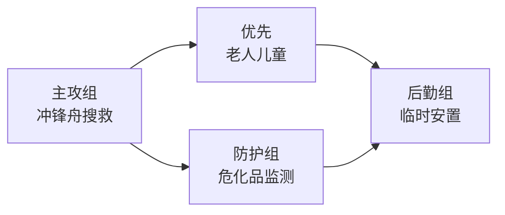

# 洪水救援场景画像模板

**场景编号**：FC-01
**场景类型**：四级特殊救援（洪水）
**标签**：#洪水救援 #四级特殊救援 #危化品复合风险 #夜间救援 #冲锋舟

---

## 1. 场景概述

| 属性 | 内容 |
|------|------|
| 场景类型 | 洪水救援 |
| 风险等级 | 四级（最高级特殊救援） |
| 核心难点 | 水域 + 夜间 + 危化品复合风险 |
| 典型装备 | 冲锋舟、救援艇、救生衣、夜视仪、化学防护服 |

---

## 2. 典型警情特征

### 报警内容特征
- "发大水了"、"水已经漫到X楼"
- "有人被困"、"老人小孩"
- 可能涉及附近工厂、仓库

### 关键问询序列（非对称路由）
1. **水位情况**："水位大概到几楼？"
2. **被困人员**："有多少人被困？老人小孩多少人？"
3. **危险品风险**："附近有什么工厂或化学品仓库？"
4. **道路情况**："道路还能通行吗？水最深在哪？"

### 画像补全要素
| 维度 | 要素 |
|------|------|
| 人员 | 被困人数、年龄分布 |
| 环境 | 水深、持续时间、天气 |
| 危险品 | 化学品类型、泄漏情况 |
| 地理 | 低洼区域、河流、水源 |

---

## 3. 规模计算参数

### 车辆/装备配置
| 装备类型 | 配置数量 | 备注 |
|----------|----------|------|
| 冲锋舟 | 8艘 | 每艘载6-8人 |
| 救援艇 | 6艘 | 大型，可载10-15人 |
| 救生衣 | 200件 | 备用 |
| 夜视仪 | 20台 | 夜间必需 |
| 化学防护服 | 30套 | 危化品区域 |
| 医疗保障 | 2组 | 临时安置点 |

### 人员配置
| 角色 | 人数 | 职责 |
|------|------|------|
| 水域救援队 | 60人 | 主攻搜救 |
| 特勤队 | 30人 | 增援 |
| 危化品处置组 | 15人 | 监测处置 |
| 医疗组 | 10人 | 救治 |
| 后勤组 | 15人 | 安置保障 |

---

## 4. 战术方案模板

### 分区分批救援

### 时间线
| 时间节点 | 行动 |
|----------|------|
| T+0~20min | 第一波冲锋舟抵达 |
| T+30min | 危化品监测组到位 |
| T+60min | 第二波增援到达 |

---

## 5. 约束校验要点

| 约束维度 | 校验内容 |
|----------|----------|
| 水深限制 | 普通车辆无法通行 → 冲锋舟 |
| 夜间环境 | 增加夜视装备 + 照明设备 |
| 危化品风险 | 必须先派化学防护小组 |
| 资源紧张 | 自动调整资源配置 |

---

## 6. 案例参考

**完整案例**：[[洪水救援调派案例_0412.md]]（待补充）

---

## 7. 相关链接

- [[MOC-子场景画像.md]]
- [[MOC-核心调派引擎-详细子模块.md]]
- [[MOC-Query_Routing问题路由专区.md]]

---

**标签**：#洪水救援 #四级特殊救援 #危化品复合风险 #夜间救援 #冲锋舟 #水域救援
