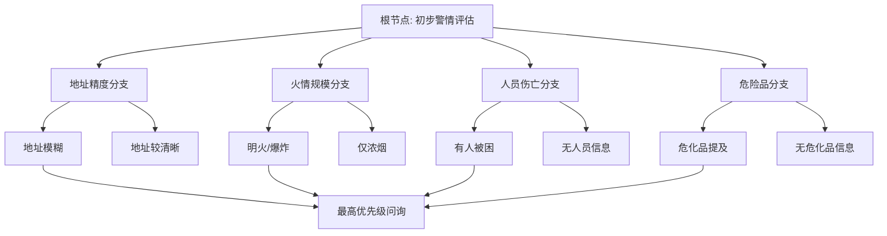

# 问题路由树（Problem Routing Tree）

**所属模块**：Query_Routing 问题路由专区
**所属Part**：Part 3 核心调派引擎
**更新日期**：2025-04-24
**版本**：V2.0

---

## 1. 概述

**问题路由树** 是 Query_Routing 模块的**核心决策引擎**，负责在警情初步解析后，**动态构建最优问询路径**，实现**非对称、智能、高效**的信息补全。

**核心价值**：
- 避免盲目、重复、无效提问
- 优先询问最高风险/最高优先级的问题
- 显著提升警情画像完整度和后续AI决策准确率
- 支持动态调整（根据实时风险变化）

---

## 2. 路由树总体结构



---

## 3. 路由树详细节点定义（V2.0）

### **根节点（Level 0）**
- 评估维度：地址精度 + 初步风险等级 + 信息缺失度
- 输出：初始优先级队列

### **一级分支（Level 1）**

| 节点 | 触发条件 | 优先级 | 推荐问题示例 | 后续分支 |
|------|----------|--------|--------------|----------|
| **地址精度** | 地址置信度 < 0.7 | ★★★★★ | "请告诉我具体在哪栋哪单元？" | 地址补全子树 |
| **火情规模** | 出现"明火""爆炸""浓烟很大"等关键词 | ★★★★★ | "看到明火还是只有烟？火势大吗？" | 规模评估子树 |
| **人员伤亡** | 提及"有人""被困""受伤" | ★★★★★ | "里面有人吗？大概几个人？" | 人员疏散子树 |
| **危险品** | 提及"汽油""电池""化学品"等 | ★★★★★ | "现场有汽油、电池或化学品吗？" | 危化品专项子树 |

### **二级分支（Level 2）示例**

- **地址补全子树**：
  - 小区名缺失 → 问小区名
  - 楼栋缺失 → 问楼栋单元
  - 精确到门牌 → 结束地址分支

- **火情规模子树**：
  - 明火 → 问面积 + 蔓延方向
  - 仅浓烟 → 问烟雾颜色 + 气味

- **人员伤亡子树**：
  - 有被困 → 问人数 + 位置 + 行动能力
  - 老人/儿童 → 提高疏散优先级

---

## 4. 路由决策算法

**优先级计算公式**（V2.0）：
```python
priority_score =
    (风险权重 × 0.55) +
    (信息缺失度 × 0.25) +
    (时间敏感度 × 0.15) +
    (历史同类案例匹配度 × 0.05)
```

**决策流程**：
1. 计算所有缺失要素的优先级分数
2. 按分数降序生成问询队列（最多5个问题）
3. 每回答一个问题后实时重新计算剩余优先级
4. 补全率达到85% 或 连续3个问题无新信息 → 结束问询

---

## 5. 实现伪代码（核心）

```python
class ProblemRoutingTree:
    def generate_query_plan(self, structured_alert):
        missing_elements = detect_missing(structured_alert)
        priority_queue = []

        for elem in missing_elements:
            score = calculate_priority_score(elem, structured_alert)
            priority_queue.append((score, elem))

        priority_queue.sort(reverse=True)  # 最高优先级在前
        return build_query_sequence(priority_queue[:5])

    def update_after_answer(self, answer, current_plan):
        update_portrait(answer)
        return self.generate_query_plan(updated_alert)  # 动态重新规划
```

---

## 6. 标准话术库联动

本路由树与 `01_标准话术库V1.md` 深度绑定：
- 地址类 → 使用位置确认话术
- 火情类 → 使用火势规模话术
- 人员类 → 使用安抚+精确询问话术

---

## 7. 版本记录

- **V2.0**（2025-04-24）：引入动态优先级重算 + 多分支并行评估
- **V1.0**：基础树状路由

---

## 标签索引
#问题路由树 #非对称问询 #动态优先级 #要素补全 #Query_Routing

---

## 相关链接
- [[非对称问询路由设计]]
- [[标准话术库V1]]
- [[问题维度映射体系.md]]
- [[MOC-Query_Routing问题路由专区.md]]
- [[MOC-核心调派引擎-详细子模块.md]]

---

**文件结束**
此文档为问题路由树的核心知识文档，建议与路由树可视化工具配合使用。