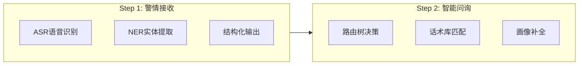
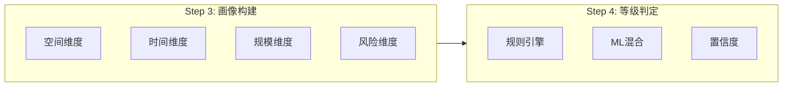
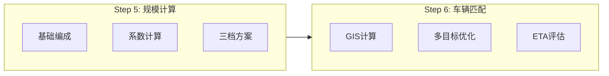
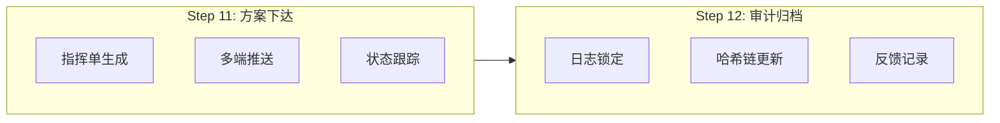

# StateMachine_12Step_Definition - 12步完整状态定义

**所属目录**：`06_DispatchEngine/StateMachine/`
**更新日期**：2025-04-25
**版本**：V1.0

---

## 12步状态定义总览







```mermaid
flowchart LR
    subgraph Step7["Step 7: 约束校验 ★]
        S7_1[资源约束]
        S7_2[时间约束]
        S7_3[安全约束]
    end

    subgraph Step8["Step 8: 反向模拟"]
        S8_1[时间线推演]
        S8_2[冲突检测]
        S8_3[调整方案]
    end

    Step7 --> Step8
```

```mermaid
flowchart LR
    subgraph Step9["Step 9: AI多智能体 ★]
        S9_A[感知15%]
        S9_B[决策40%]
        S9_C[执行20%]
        S9_D[预测25%]
    end

    subgraph Step10["Step 10: 人工确认"]
        S10_1[方案展示]
        S10_2[修改记录]
        S10_3[责任关口]
    end

    Step9 --> Step10
```



---

## 各步详细定义

### Step 1: 警情接收 (ALERT_RECEIVED)

| 属性 | 值 |
|------|---|
| 状态编码 | `ST_01` |
| 目标耗时 | < 8秒 |
| 输入 | 语音/文字报警 |
| 输出 | `structured_alert` |
| 超时处理 | 降级人工录入 |
| 回退条件 | 无 |

### Step 2: 智能问询 (QUERY_ROUTING)

| 属性 | 值 |
|------|---|
| 状态编码 | `ST_02` |
| 目标耗时 | < 60秒 |
| 输入 | `structured_alert` |
| 输出 | 补全后画像 |
| 超时处理 | 强制进入下一步 |
| 回退条件 | 信息不足继续问询 |

### Step 3: 画像构建 (PORTRAIT_BUILDING)

| 属性 | 值 |
|------|---|
| 状态编码 | `ST_03` |
| 目标耗时 | < 15秒 |
| 输入 | 补全后报警 |
| 输出 | `incident_portrait` |
| 超时处理 | 使用默认值 |
| 回退条件 | 可回退Step 2 |

### Step 4: 等级判定 (LEVEL_DETERMINATION)

| 属性 | 值 |
|------|---|
| 状态编码 | `ST_04` |
| 目标耗时 | < 10秒 |
| 输入 | 4维画像 |
| 输出 | `alert_level` + 置信度 |
| 超时处理 | ML降级规则 |
| 回退条件 | 无 |

### Step 5: 规模计算 (SCALE_CALCULATION)

| 属性 | 值 |
|------|---|
| 状态编码 | `ST_05` |
| 目标耗时 | < 20秒 |
| 输入 | `alert_level` + 画像 |
| 输出 | 三档规模方案 |
| 超时处理 | 输出最小档 |
| 回退条件 | 可回退Step 4 |

### Step 6: 车辆匹配 (VEHICLE_MATCHING)

| 属性 | 值 |
|------|---|
| 状态编码 | `ST_06` |
| 目标耗时 | < 30秒 |
| 输入 | 规模方案 |
| 输出 | 推荐中队 + 车辆清单 |
| 超时处理 | 输出本地最优解 |
| 回退条件 | 可回退Step 5 |

### Step 7: 约束校验 (CONSTRAINT_VALIDATION) ★

| 属性 | 值 |
|------|---|
| 状态编码 | `ST_07` |
| 目标耗时 | < 18秒 |
| 输入 | 匹配方案 |
| 输出 | Pass / Warning / Fail |
| 超时处理 | Warning继续 |
| 回退条件 | **Fail回退Step 5** |

### Step 8: 反向模拟 (REVERSE_SIMULATION)

| 属性 | 值 |
|------|---|
| 状态编码 | `ST_08` |
| 目标耗时 | < 25秒 |
| 输入 | 校验通过方案 |
| 输出 | 模拟结果 + 调整方案 |
| 超时处理 | 使用推荐档 |
| 回退条件 | 可回退Step 6 |

### Step 9: AI多智能体 (MULTI_AGENT) ★

| 属性 | 值 |
|------|---|
| 状态编码 | `ST_09` |
| 目标耗时 | < 60秒 |
| 输入 | 模拟结果 |
| 输出 | 最终战术方案 |
| 超时处理 | 加权投票 |
| 回退条件 | 无 |

### Step 10: 人工确认 (HUMAN_CONFIRMATION)

| 属性 | 值 |
|------|---|
| 状态编码 | `ST_10` |
| 目标耗时 | < 300秒 |
| 输入 | AI方案 |
| 输出 | 最终确认方案 |
| 超时处理 | 自动通过 |
| 回退条件 | 可终止流程 |

### Step 11: 方案下达 (DISPATCH_ISSUING)

| 属性 | 值 |
|------|---|
| 状态编码 | `ST_11` |
| 目标耗时 | < 15秒 |
| 输入 | 确认方案 |
| 输出 | `dispatch_package` |
| 超时处理 | 重试3次 |
| 回退条件 | 无 |

### Step 12: 审计归档 (AUDIT_ARCHIVING)

| 属性 | 值 |
|------|---|
| 状态编码 | `ST_12` |
| 目标耗时 | < 10秒 |
| 输入 | 执行结果 |
| 输出 | `audit_trace` |
| 超时处理 | 同步写入 |
| 回退条件 | 无（终态） |

---

## 状态转换矩阵

| 当前状态 | 目标状态 | 触发条件 | 转换动作 |
|----------|----------|----------|----------|
| ST_01 | ST_02 | 解析完成 | 初始化路由树 |
| ST_02 | ST_03 | 画像补全≥85% | 触发画像构建 |
| ST_03 | ST_04 | 画像生成完成 | 触发等级判定 |
| ST_04 | ST_05 | 等级输出完成 | 查询编成表 |
| ST_05 | ST_06 | 规模方案生成 | 触发GIS匹配 |
| ST_06 | ST_07 | 匹配结果输出 | 触发五维校验 |
| ST_07 | ST_08 | 校验Pass/Warning | 触发反向模拟 |
| ST_07 | ST_05 | 校验Fail | 回退规模计算 |
| ST_08 | ST_09 | 模拟完成 | 触发多智能体 |
| ST_09 | ST_10 | 仲裁完成 | 推送人工确认 |
| ST_10 | ST_11 | 人工确认通过 | 生成指挥单 |
| ST_10 | END | 人工终止 | 记录终止原因 |
| ST_11 | ST_12 | 下达成功 | 触发归档 |
| ST_12 | END | 归档完成 | 流程结束 |

---

**标签**：#12步状态 #状态定义 #转换规则