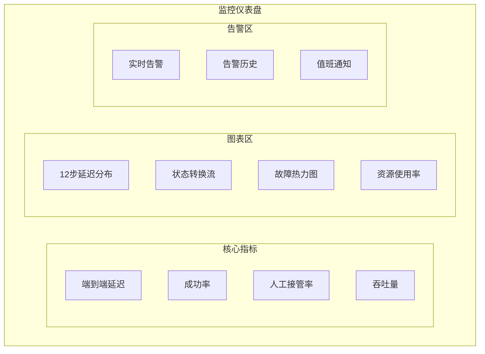

# StateMachine_Monitoring_Dashboard - 监控仪表盘

**所属目录**：`06_DispatchEngine/StateMachine/`
**更新日期**：2025-04-25
**版本**：V1.0

---

## 1. 监控仪表盘设计

### 1.1 整体视图



---

## 2. 核心监控指标

### 2.1 SLA指标

| 指标 | 目标 | 黄色告警 | 红色告警 |
|------|------|----------|----------|
| 系统可用性 | ≥ 99.9% | < 99.5% | < 99% |
| 端到端延迟P99 | < 5分钟 | > 6分钟 | > 8分钟 |
| 成功率 | ≥ 95% | < 92% | < 90% |
| 人工接管率 | ≤ 10% | > 15% | > 20% |

### 2.2 各Step指标

| Step | 延迟目标 | 错误率目标 | 超时阈值 |
|------|----------|------------|----------|
| ST_01 | < 8秒 | < 0.1% | 30秒 |
| ST_02 | < 60秒 | < 1% | 90秒 |
| ST_03 | < 15秒 | < 0.5% | 30秒 |
| ST_04 | < 10秒 | < 0.5% | 20秒 |
| ST_05 | < 20秒 | < 0.5% | 40秒 |
| ST_06 | < 30秒 | < 1% | 60秒 |
| ST_07 | < 18秒 | < 0.5% | 36秒 |
| ST_08 | < 25秒 | < 1% | 50秒 |
| ST_09 | < 60秒 | < 2% | 120秒 |
| ST_10 | < 300秒 | - | 600秒 |
| ST_11 | < 15秒 | < 0.5% | 45秒 |
| ST_12 | < 10秒 | < 0.1% | 30秒 |

---

## 3. 告警规则

### 3.1 告警分级

| 级别 | 名称 | 触发条件 | 通知方式 |
|------|------|----------|----------|
| P1 | 红色 | 连续3次致命故障 | 推送值班长+短信 |
| P2 | 橙色 | 连续重度故障≥5次 | 推送值班员 |
| P3 | 黄色 | 单步超时或错误率>阈值 | 记录日志 |
| P4 | 蓝色 | 性能降级 | 监控仪表盘展示 |

### 3.2 告警规则配置
```yaml
alert_rules:
  - name: critical_failure_chain
    condition: consecutive_failures >= 3
    severity: P1
    actions: [notify_duty_leader, notify_sms, create_incident]

  - name: high_error_rate
    condition: step_error_rate > 0.05
    severity: P2
    actions: [notify_duty, create_incident]

  - name: latency_degradation
    condition: p99_latency > 360
    severity: P3
    actions: [log_alert]

  - name: cache_hit_rate_low
    condition: cache_hit_rate < 0.3
    severity: P4
    actions: [update_dashboard]
```

---

## 4. 实时状态监控

### 4.1 状态分布
```json
{
  "state_distribution": {
    "ALERT_RECEIVED": 3,
    "QUERY_ROUTING": 8,
    "PORTRAIT_BUILDING": 5,
    "LEVEL_DETERMINATION": 2,
    "SCALE_CALCULATION": 4,
    "VEHICLE_MATCHING": 6,
    "CONSTRAINT_VALIDATION": 3,
    "REVERSE_SIMULATION": 2,
    "MULTI_AGENT": 4,
    "HUMAN_CONFIRMATION": 12,
    "DISPATCH_ISSUING": 1,
    "AUDIT_ARCHIVING": 0
  },
  "total_in_progress": 50
}
```

### 4.2 转换速率
```json
{
  "transition_rates": {
    "ST_01_to_ST_02": 120,
    "ST_02_to_ST_03": 115,
    "ST_07_to_ST_05": 5,
    "ST_10_to_END": 3
  },
  "avg_completion_time": 180
}
```

---

## 5. 故障监控

### 5.1 故障热力图
```
时间段    ST01  ST02  ST03  ST04  ST05  ST06  ST07  ST08  ST09
00:00-04:00  0     0     0     0     0     0     0     0     0
04:00-08:00  1     2     0     0     1     0     0     0     1
08:00-12:00  2     5     1     0     2     3     1     0     2
12:00-16:00  1     3     0     1     1     2     0     1     1
16:00-20:00  3     8     2     1     3     4     2     1     3
20:00-24:00  1     4     0     0     1     1     0     0     1
```

### 5.2 故障分类统计
```json
{
  "fault_classification": {
    "timeout": 45,
    "service_unavailable": 12,
    "validation_fail": 28,
    "agent_conflict": 8,
    "human_takeover": 15
  }
}
```

---

## 6. 仪表盘访问

| 环境 | URL | 刷新频率 |
|------|-----|----------|
| 测试 | `http://monitor.test.local:3000` | 10秒 |
| 预生产 | `http://monitor.staging.local:3000` | 5秒 |
| 生产 | `http://monitor.prod.local:3000` | 5秒 |

---

**标签**：#监控仪表盘 #告警规则 #SLA #KPI