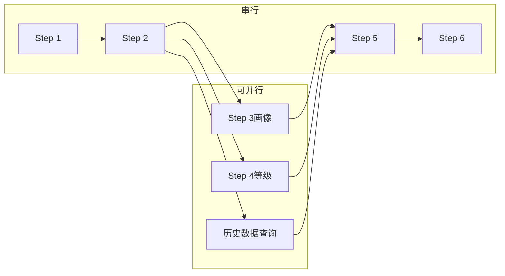

# StateMachine_Performance_Optimization - 性能优化

**所属目录**：`06_DispatchEngine/StateMachine/`
**更新日期**：2025-04-25
**版本**：V1.0

---

## 1. 性能目标

| 指标 | 目标值 | 告警阈值 |
|------|--------|----------|
| 端到端延迟（P99） | < 5分钟 | > 6分钟 |
| 单步平均延迟 | < 目标耗时的80% | > 目标耗时 |
| 并行化率 | > 60% | < 50% |
| 缓存命中率 | > 40% | < 30% |
| 系统可用性 | > 99.9% | < 99.5% |

---

## 2. 并行优化策略

### 2.1 可并行执行的Step组合



### 2.2 并行化实现
```python
async def parallel_step3_4(portrait_input):
    # 同时执行画像构建和等级判定
    portrait_task = build_portrait(portrait_input)
    level_task = determine_level(portrait_input)

    portrait, level = await asyncio.gather(portrait_task, level_task)

    return {
        "portrait": portrait,
        "level": level
    }
```

---

## 3. 缓存策略

### 3.1 多级缓存

| 缓存层 | 存储 | TTL | 适用场景 |
|--------|------|-----|----------|
| L1内存 | Redis | 5分钟 | 实时特征、路由决策 |
| L2本地 | 进程内存 | 30秒 | 短期计算结果 |
| L3持久 | PostgreSQL | 1小时 | 历史案例、编成表 |

### 3.2 缓存Key设计
```
portrait:{incident_type}:{area}:{time_bucket}
level:{portrait_hash}:{hour}
scale:{level}:{building_type}:{month}
matching:{station}:{vehicle_type}:{time_bucket}
```

---

## 4. 异步处理

### 4.1 非关键路径异步化
```python
async def dispatch_flow(incident_id):
    # 同步主流程
    structured = await step1_parse(incident_id)
    portrait = await step2_routing(structured)

    # 启动异步任务（非阻塞）
    asyncio.create_task(step12_audit(incident_id))

    # 继续同步流程
    level = await step3_portrait(portrait)
    # ...
```

### 4.2 批量处理
```
高并发场景：将相似警情批量处理
- 同一区域的多起警情
- 同一类型的预处理
```

---

## 5. 资源优化

### 5.1 连接池
```python
# GIS连接池
gis_pool = ConnectionPool(
    max_connections=50,
    timeout=30,
    retry=3
)

# 数据库连接池
db_pool = ConnectionPool(
    max_connections=100,
    min_connections=10,
    idle_timeout=300
)
```

### 5.2 限流策略
```yaml
rate_limits:
  step6_gis:
    max_rps: 100
    burst: 20
  step9_agent:
    max_rps: 50
    burst: 10
  global:
    max_concurrent: 200
```

---

## 6. 监控指标

### 6.1 关键性能指标 (KPI)
```
- P50延迟：各Step中位数
- P95延迟：各Step 95分位
- P99延迟：各Step 99分位
- 吞吐率：每分钟处理警情数
- 错误率：各Step失败率
```

### 6.2 仪表盘配置
```yaml
dashboard:
  refresh_interval: 5s
  charts:
    - name: end_to_end_latency
      type: histogram
      buckets: [30, 60, 120, 180, 300]
    - name: step_latency_breakdown
      type: bar
    - name: error_rate_by_step
      type: line
    - name: cache_hit_rate
      type: gauge
```

---

## 6. 运维KPI（源自运维视角MOC）

| 指标 | 说明 | 目标 |
|------|------|------|
| 系统健康度 | 可用时间比例 | ≥99.5% |
| 响应延迟P99 | 端到端延迟 | <1s |
| 故障恢复时间 | MTTR | <5min |
| 人工介入率 | 需要人工处理比例 | <15% |

---

## 7. 多级缓存体系（源自运维视角MOC）

### 7.1 缓存层级

| 缓存层 | 存储 | TTL | 适用场景 |
|--------|------|-----|----------|
| L1内存 | Redis | 5分钟 | 实时特征、路由决策 |
| L2本地 | 进程内存 | 30秒 | 短期计算结果 |
| L3持久 | PostgreSQL | 1小时 | 历史案例、编成表 |

**缓存命中率目标：>40%**

### 7.2 缓存Key设计
```
portrait:{incident_type}:{area}:{time_bucket}
level:{portrait_hash}:{hour}
scale:{level}:{building_type}:{month}
matching:{station}:{vehicle_type}:{time_bucket}
```

---

## 8. 性能优化Checklist（源自运维视角MOC）

- **日常巡检**：每日查看仪表盘，重点关注Step7（约束校验）和Step9（AI决策）
- **每周分析**：回退率和人工介入率，优化规则/模型
- **每月压测**：进行一次性能压力测试
- **缓存优化**：L1命中率<30%告警，L2命中率<50%优化
- **并行化监控**：并行化率目标>60%，低于50%需优化

---

**标签**：#性能优化 #缓存策略 #并行处理 #监控 #运维KPI