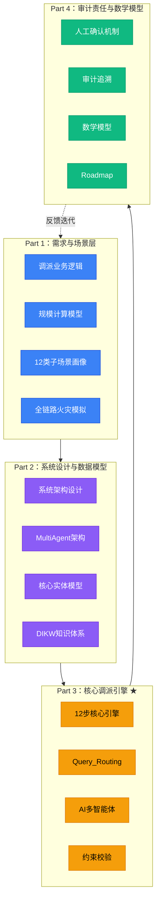

# 消防调派智能系统 - 全局视图（完整思维导图融合版）

**标签**：#全局视图 #思维导图 #完整融合 #MOC #知识体系
**位置**：`00_GlobalNavigation/`
**更新日期**：2025-04-25
**版本**：V1.0（融合版）

---

## 0. 系统定位

```
┌─────────────────────────────────────────────────────────────────┐
│                    消防调派智能系统                               │
│         Fire Dispatch Intelligent System (FDIS)                   │
├─────────────────────────────────────────────────────────────────┤
│  定位：AI辅助消防调派的"最强大脑"                                  │
│  使命：秒级响应 + 全链路智能 + 零风险兜底                          │
│  架构：规则引擎 + ML混合 + Multi-Agent + 人工确认                  │
└─────────────────────────────────────────────────────────────────┘
```

---

## 1. 全局架构（四大Part）



---

## 2. 全链路12步引擎（Part 3核心）

```mermaid
flowchart LR
    subgraph Step9["Step 9: AI多智能体 ★"]
        S9_A[感知Agent 15%]
        S9_B[决策Agent 40%]
        S9_C[执行Agent 20%]
        S9_D[预测Agent 25%]
        S9_E[LLM仲裁器]
    end

    subgraph Step10["Step 10: 人工确认"]
        S10_A[调度员复核]
        S10_B[修改记录]
        S10_C[责任关口]
    end

    subgraph Step11["Step 11: 方案下达"]
        S11_A[指挥单生成]
        S11_B[多端推送]
        S11_C[状态跟踪]
    end

    subgraph Step12["Step 12: 审计归档"]
        S12_A[不可篡改日志]
        S12_B[区块链哈希]
        S12_C[训练反馈]
    end

    Step9 --> Step10 --> Step11 --> Step12
```




---

## 3. Part 1：需求与场景层（业务基础）

```
Part 1：需求与场景层
├── 1. 调派业务逻辑
│   ├── 01_Dispatch_Scale_Calculation_Model.md（核心模型）
│   ├── 06_Dispatch_Business_Logic.md（业务逻辑总览）
│   └── Ten_Subscenario_Calculation_Examples.md（十类计算示例）
│
├── 2. 子场景画像（12类）
│   ├── SubScenario_Portraits/MOC-子场景画像.md（总入口）
│   ├── 01_普通住宅火灾画像.md（RES-01）
│   ├── 02_高层住宅火灾画像.md（HIGH-01）
│   ├── 03_城中村火灾画像.md（VILL-01）
│   ├── 04_化工园区火灾画像.md（CHEM-01）
│   ├── 05_地下空间火灾画像.md（UGRD-01）
│   ├── 06_医院火灾画像.md（HOSP-01）
│   ├── 07_学校火灾画像.md（SCHL-01）
│   ├── 08_商业综合体火灾画像.md（MALL-01）
│   ├── 09_厂房火灾画像.md（FACT-01）
│   ├── 10_仓库火灾画像.md（STOR-01）
│   └── 11_特殊场景火灾画像.md（SPEC-01）
│
├── 3. 全链路火灾模拟
│   ├── Full_Link_Simulations/MOC-全链路模拟.md
│   ├── 一级火灾场景全链路模拟.md
│   ├── 二级火灾场景全链路模拟.md
│   ├── 三级火灾场景全链路模拟.md
│   └── 四级火灾场景全链路模拟.md
│
└── 4. 项目定义与竞品分析
    ├── 03_FireCommandAI项目定义.md
    ├── 07_Competitor_Analysis.md（竞品分析）
    └── SOP相关表单
```

### 规模计算核心公式
```
推荐车辆数 = round(基础车辆数 × 总系数)
总系数 = 建筑系数 × 风险系数 × 时间系数 × 面积系数（上限3.5）
单中队出车率 ≤ 70%
```

| 等级 | 基础编成 | 车辆数 |
|------|----------|--------|
| 一级 | 水罐1 + 抢险1 | 2辆 |
| 二级 | 水罐2 + 举高1 + 抢险1 | 4辆 |
| 三级 | 水罐4 + 举高2 + 特勤1 + 抢险1 | 8辆 |
| 四级 | 水罐6 + 泡沫3 + 举高2 + 特勤2 + 洗消1 + 医疗1 | 15辆 |

---

## 4. Part 2：系统设计与数据模型（架构桥梁）

```
Part 2：系统设计与数据模型
├── 1. 系统概述与目标
│   ├── 01_Overview_And_Goals.md
│   ├── 02_Data_Flow_And_State_Machine.md
│   └── 03_System_Architecture_Design.md
│
├── 2. MultiAgent多智能体架构
│   ├── MultiAgent_Architecture/消防多智能体架构.md（详细版）
│   ├── 消防多智能体架构.md
│   ├── 消防多智能体应用.md
│   └── 接处警AI总体流程.md
│
├── 3. 数据模型
│   ├── 05_DataModel/01_Core_Entities_And_Domain_Model.md
│   ├── 05_DataModel/02_ER_Diagram_And_Relation_Model.md
│   ├── 05_DataModel/03_Database_Table_Structure.md
│   └── 05_DataModel/04_Label_System_Design.md
│
├── 4. 知识体系（DIKW）
│   ├── 04_DIKW_Examples/MOC-DIKW转化示例.md
│   ├── 01_Ordinary_Fire_DIKW.md
│   ├── 02_Hazmat_Fire_DIKW.md
│   └── 03_HighRise_Fire_DIKW.md
│
└── 5. Obsidian知识库方案
    ├── Obsidian+知识库体系.md
    └── 08_Obsidian+OpenClaw+Claude知识库方案.md
```

### MultiAgent四Agent架构

| Agent | 职责 | 权重 | 输入 | 输出 |
|-------|------|------|------|------|
| 感知Agent | 场景理解与事实基础 | 15% | 画像+模拟结果 | 场景标签+历史案例 |
| 决策Agent | 战术规划与力量分工 | **40%** | 感知输出 | 主攻方向+任务分工 |
| 执行Agent | 可执行性验证与指令生成 | 20% | 决策输出 | 时间线+指令模板 |
| 预测Agent | 前瞻性风险与态势预测 | 25% | 全局+决策输出 | 火势蔓延+次生灾害 |

### 仲裁机制（5阶段）
1. 结果标准化（统一JSON Schema）
2. 交叉验证（检测Agent间不一致）
3. 加权投票（默认权重）
4. LLM仲裁器（分歧>0.3时触发）
5. 二次验证（送回再校验）

---

## 5. Part 3：核心调派引擎（系统大脑）

```
Part 3：核心调派引擎 ★
├── 1. 引擎核心机制
│   ├── 07_Dispatch_Engine_Implementation.md（引擎实现总览）
│   ├── 01_Alert_Level_Mapping.md（警情等级映射）
│   ├── 02_Reverse_Verification_Logic.md（反向校验逻辑）
│   ├── 04_Constraint_Validation_Mechanism.md（约束校验机制）
│   └── 06_Dispatch_Layer_Governance.md（编排层治理）
│
├── 2. Query_Routing问题路由专区
│   ├── Query_Routing/MOC-Query_Routing问题路由专区.md（知识枢纽）
│   ├── 00_非对称问询路由设计.md
│   ├── 01_标准话术库V1.md
│   ├── 问题路由树.md（V2.0动态优先级）
│   ├── 问题维度映射体系.md
│   ├── 多维问题与要素识别.md
│   └── 补充问题类型维度.md
│
├── 3. AI多智能体决策支持
│   ├── AI_Support/01_AILLM应急指挥智能决策支持.md
│   ├── AI_Support/消防多智能体架构.md
│   ├── AI_Support/消防多智能体应用.md
│   └── AI_Support/接处警AI总体流程.md
│
└── 4. 约束校验详情
    ├── 05_Constraint_Validation_Details.md
    └── 07_Dispatch_Engine_Implementation.md
```

### Query_Routing路由决策算法

```python
priority_score = (
    风险权重 × 0.55 +
    信息缺失度 × 0.25 +
    时间敏感度 × 0.15 +
    历史同类案例匹配度 × 0.05
)
```

**决策流程**：
1. 计算所有缺失要素的优先级分数
2. 按分数降序生成问询队列（最多5个问题）
3. 每回答一个问题后实时重新计算
4. 补全率达85% 或 连续3个问题无新信息 → 结束问询

### 路由树一级分支

| 节点 | 触发条件 | 优先级 |
|------|----------|--------|
| 地址精度 | 地址置信度 < 0.7 | ★★★★★ |
| 火情规模 | 出现"明火""爆炸""浓烟" | ★★★★★ |
| 人员伤亡 | 提及"有人""被困""受伤" | ★★★★★ |
| 危险品 | 提及"汽油""电池""化学品" | ★★★★★ |

---

## 6. Part 4：审计责任与数学模型（合规保障）

```
Part 4：审计责任、数学模型与附录
├── 1. 人工确认与责任机制
│   ├── 01_Human_Confirmation_And_Responsibility.md（人工确认与责任）
│   ├── 02_Audit_Trace_And_Immutable_Log.md（审计轨迹与不可篡改日志）
│   └── 06_Dispatch_Responsibility_Mechanism.md（调派责任机制）
│
├── 2. 数学模型全链路
│   ├── 05_Math_Model_Full_Link.md（数学模型全链路）
│   ├── 02_Optimization_Suggestions.md（优化建议）
│   └── 04_Constraint_Optimization_Model.md（约束优化模型）
│
├── 3. 项目Roadmap
│   ├── 09_Roadmap/README.md
│   └── Roadmap相关文档
│
└── 4. 附录
    └── 10_Appendix/公式汇总.md
```

### 责任闭环
```
AI辅助决策 → 人工最终确认 → 方案锁定 → 审计留痕 → 责任追溯
```

### 责任主体映射

| 步骤 | 主要责任人 | 责任类型 |
|------|-----------|----------|
| 第1-2步 | 接警员 | 信息采集 |
| 第3-8步 | AI系统 | 分析与方案生成 |
| 第10步 | 调度员 | 最终确认（关键责任关口） |
| 第11-12步 | 系统 | 执行与审计 |

### 数学模型核心公式

| 公式 | 描述 |
|------|------|
| `推荐车辆数 = round(基础车辆数 × 总系数)` | 规模计算 |
| `总系数 = 建筑系数 × 风险系数 × 时间系数 × 面积系数` | 系数计算（上限3.5） |
| `final_score = 0.45 × rule_score + 0.55 × ml_score` | 混合判定 |
| `单中队出车率 ≤ 70%` | 资源约束 |

---

## 7. 数据流总览（贯穿全链路）

```
Incident（警情）
    ↓
AlertStructured（结构化警情） ← Step 1
    ↓
IncidentPortrait（警情画像） ← Step 2-3
    ↓
AlertLevelResult（等级判定） ← Step 4
    ↓
DispatchScaleResult（规模计算） ← Step 5
    ↓
StationVehicleMatching（队站匹配） ← Step 6
    ↓
CommandPlan（指挥方案） ← Step 7-9
    ↓
FinalApprovedPlan（最终方案） ← Step 10
    ↓
DispatchPackage（下发数据包） ← Step 11
    ↓
AuditTrace（审计轨迹） ← Step 12
```

---

## 8. 核心标签体系

| 维度 | 标签 | 说明 |
|------|------|------|
| Type | 火灾类型 | RES/HIGH/VILL/CHEM/UGRD/HOSP/SCHL/MALL/FACT/STOR/SPEC |
| State | 火情状态 | INITIAL/DEVELOPING/PICAKING/SUPPRESSING/SUBDUED |
| Source | 信息来源 | CALLER/SENSOR/SYSTEM |
| Topic | 问题主题 | ADDRESS/FIRE_SCALE/CASUALTY/HAZMAT/EVACUATION |
| Transition | 状态转换 | 标签状态变迁记录 |

---

## 9. 阅读路径推荐

### 新成员路径
```
Part 1 README → Part 1 子场景画像 → Part 2 MultiAgent架构
→ Part 3 引擎总览 → Part 3 Query_Routing → Part 3 AI多智能体
→ Part 4 审计责任
```

### 开发人员路径
```
Part 3 引擎实现文档 → Part 3 约束校验 → Part 3 Query_Routing
→ Part 2 数据模型 → Part 2 MultiAgent → Part 1 规模计算
```

### 运维/审计人员路径
```
Part 4 审计机制 → Part 4 数学模型 → Part 3 约束校验
→ Part 3 引擎治理 → Part 3 反向校验
```

### 业务分析人员路径
```
Part 1 规模计算模型 → Part 1 十类场景示例 → Part 1 全链路模拟
→ Part 3 AI多智能体 → Part 4 责任机制
```

---

## 10. 版本记录

| 版本 | 日期 | 变更说明 |
|------|------|----------|
| V1.0 | 2025-04-25 | 融合全部Part为完整全局视图 |

---

## 11. 相关链接

| 链接类型 | 文件 |
|----------|------|
| 全局导航 | [[00_GlobalNavigation]] |
| Part 1 | [[01_Requirements/Part1-README.md]] |
| Part 2 | [[03_SystemDesign/Part2-README.md]] |
| Part 3 | [[06_DispatchEngine/Part3-README.md]] |
| Part 4 | [[07_Audit_And_Responsibility/Part4-README.md]] |
| 逻辑索引 | [[02_Part逻辑映射索引]] |

---

## 12. 扩展模块：FRICP智慧消防一体化指挥平台

**FRICP定位**：与FireDispatchEngine**互补**的扩展模块

| 维度 | FRICP | FireDispatchEngine |
|------|-------|-------------------|
| 核心定位 | 合规报告 + 职责隔离 | 智能调派引擎 |
| 技术路线 | 无大模型、人工录入 | AI多智能体、ML混合 |
| 职责模式 | 前场只打仗、后场管指挥上报 | 12步智能决策闭环 |

**FRICP核心价值**：
- **职责清晰**：后方指挥中心承担全部上报责任，现场零上报责任
- **报告合规**：严格落实"八条硬规矩"
- **成本可控**：387万总投入，复用现有系统
- **快速落地**：最短6周上线MVP

**FRICP三有界上下文**：
| 上下文 | 职责 |
|--------|------|
| 事实核实上下文 | 客观事实核实 + 人工录入 |
| 报告生成上下文 | 核心最严格，只允许事实部分 |
| 合规审计上下文 | 全局存证追溯 |

**相关文档**：
- [[raw/智慧消防救援一体化指挥平台FRICP建设方案.md]]（完整方案）
- [[raw/价值点提取_智慧消防救援一体化指挥平台FRICP.md]]（价值点提取）

---

**文件结束**