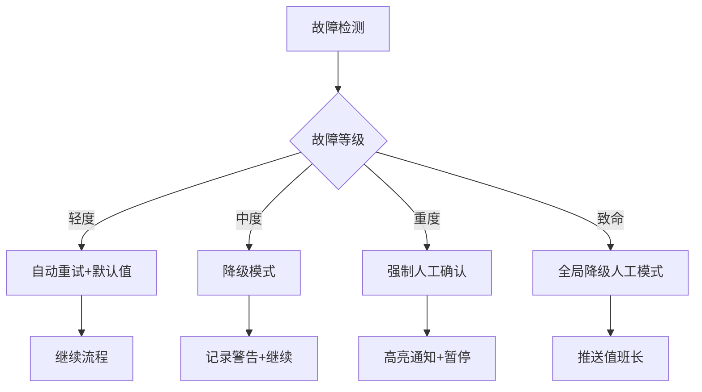
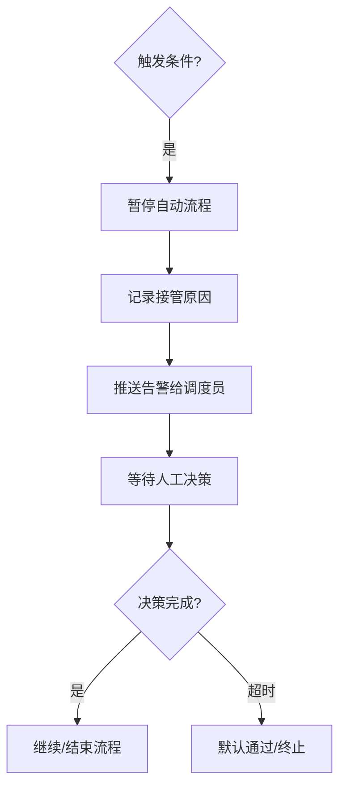

# StateMachine_Fault_Tolerance - 容错机制

**所属目录**：`06_DispatchEngine/StateMachine/`
**更新日期**：2025-04-25
**版本**：V1.0

---

## 1. 故障处理总体原则

| 原则 | 说明 |
|------|------|
| **安全优先** | 任何故障都倾向于保守方案或人工介入 |
| **分级降级** | 自动恢复 → 局部降级 → 全局回退 → 人工接管 |
| **全链路可观测** | 所有故障记录到审计日志 |
| **快速恢复** | 目标恢复时间 < 15秒（大部分场景） |

---

## 2. 故障分级与处理策略



| 等级 | 典型场景 | 处理策略 | 恢复时间 | 人工通知 |
|------|----------|----------|----------|----------|
| **轻度** | 单步超时、输出置信度低 | 重试1次 + 缓存/默认值 | < 5秒 | 否 |
| **中度** | 2个子系统失败、校验冲突大 | 降级模式（关闭预测Agent） | 5-15秒 | 记录警告 |
| **重度** | 3个以上组件失败、仲裁不可用 | 强制人工确认 + 标记高风险 | < 10秒 | 是（高亮） |
| **致命** | 核心服务崩溃、框架不可用 | 全局降级为纯人工模式 | 立即 | 是（推送值班长） |

---

## 3. 各Step容错策略

### Step 1-4 容错

| Step | 故障场景 | Fallback策略 |
|------|----------|--------------|
| ST_01 | ASR识别失败 | 切换文字输入模式 |
| ST_02 | 路由树超时 | 强制进入Step 3（使用当前信息） |
| ST_03 | 画像构建失败 | 使用基础画像模板 |
| ST_04 | ML模型不可用 | 回退纯规则引擎判定 |

### Step 5-8 容错

| Step | 故障场景 | Fallback策略 |
|------|----------|--------------|
| ST_05 | ML系数计算失败 | 使用规则基础系数 |
| ST_06 | GIS服务不可用 | 使用历史平均ETA |
| ST_07 | 校验引擎超时 | 回退基础规则检查 |
| ST_08 | 模拟超时 | 使用推荐档直接继续 |

### Step 9-12 容错

| Step | 故障场景 | Fallback策略 |
|------|----------|--------------|
| ST_09 | Agent失败 | 加权投票（无LLM仲裁） |
| ST_09 | LLM仲裁超时 | 使用加权投票结果 |
| ST_10 | 人工超时 | 自动通过（需记录） |
| ST_11 | 推送失败 | 重试3次 + 记录待确认 |
| ST_12 | 归档失败 | 写入降级日志 + 告警 |

---

## 4. 重试机制

### 指数退避策略
```
重试间隔：1s → 2s → 4s → 8s → 16s（最大）
最多重试次数：5次
超时阈值：15秒
```

### 代码示例
```python
def run_with_retry(func, max_attempts=5, timeout=15):
    for attempt in range(max_attempts):
        try:
            result = func(timeout=timeout)
            if is_valid(result):
                return result
        except Exception as e:
            wait_time = 2 ** attempt
            asyncio.sleep(wait_time)
    return fallback_strategy(func)
```

---

## 5. 降级模式

### 5.1 多智能体降级

| 级别 | 可用Agent | 仲裁方式 |
|------|-----------|----------|
| 正常 | 4个全开 | LLM仲裁 |
| L1降级 | 决策+执行 | 加权投票 |
| L2降级 | 仅执行 | 规则模板 |
| L3降级 | 无Agent | 纯人工 |

### 5.2 ML模型降级

| 级别 | ML状态 | 判定方式 |
|------|--------|----------|
| 正常 | 可用 | ML权重55% |
| L1降级 | 可用但慢 | ML权重30% |
| L2降级 | 不可用 | 纯规则 |
| L3降级 | 极端不可用 | 默认值 |

---

## 6. 人工接管机制

### 6.1 自动触发人工的条件
```
1. 连续3次重度故障
2. 置信度 < 0.75
3. 人工确认超时（300秒）
4. 任何Step发生致命故障
5. 调度员主动介入
```

### 6.2 人工接管流程


---

## 7. 监控与告警

### 关键指标
| 指标 | 阈值 | 告警级别 |
|------|------|----------|
| 故障率（每小时） | > 5% | 黄色 |
| 人工接管率 | > 15% | 橙色 |
| 连续重度故障 | ≥ 3次 | 红色 |
| 平均恢复时间 | > 30秒 | 黄色 |

### 告警配置
```yaml
alerts:
  - name: high_failure_rate
    condition: failure_rate > 0.05
    severity: warning
  - name: human_takeover_high
    condition: human_takeover_rate > 0.15
    severity: orange
  - name: critical_failure
    condition: consecutive_failures >= 3
    severity: critical
    notify: [duty_leader, on_call]
```

---

## 8. 运维故障处理Checklist（源自运维视角MOC）

### 日常故障处理SOP

| 故障等级 | 典型场景 | 处理策略 | 恢复时间 | 人工通知 |
|----------|----------|----------|----------|----------|
| 轻度 | 单步超时、输出置信度低 | 重试1次+缓存/默认值 | <5秒 | 否 |
| 中度 | 2个子系统失败、校验冲突大 | 降级模式（关闭预测Agent） | 5-15秒 | 记录警告 |
| 重度 | 3个以上组件失败、仲裁不可用 | 强制人工确认+标记高风险 | <10秒 | 是（高亮） |
| 致命 | 核心服务崩溃、框架不可用 | 全局降级纯人工模式 | 立即 | 是（推送值班长） |

### 运维Checklist
- **轻度故障**：自动重试 → 检查缓存 → 继续流程
- **中度故障**：降级模式 → 记录警告 → 继续流程
- **重度故障**：立即人工接管 → 高亮通知 → 标记高风险
- **致命故障**：推送值班长 → 全局降级 → 立即处理

### 人工接管触发条件（来自运维视角）
1. 连续3次重度故障
2. 置信度 < 0.75
3. 人工确认超时（300秒）
4. 任何Step发生致命故障
5. 调度员主动介入

---

**标签**：#容错机制 #故障处理 #降级策略 #人工接管 #运维Checklist