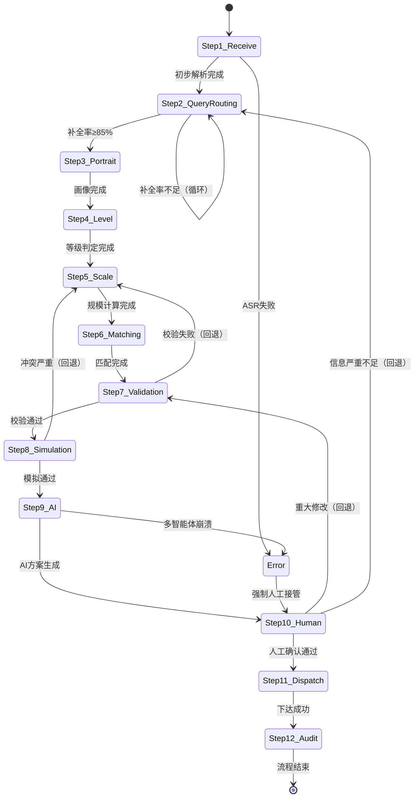

# 12步完整流程状态机设计

**来源**：消防调派智能系统12步状态机
**版本**：V1.0

---

## 1. 为什么需要状态机

12步流程不是简单的线性顺序，而是包含：
- **顺序执行**（主流）
- **条件分支**（校验失败、置信度低）
- **回退循环**（第7、8、10步）
- **并行处理**（AI多智能体内部）
- **人工干预点**（第10步）
- **异常与降级**（故障处理）

---

## 2. 完整状态机Mermaid图表

---

## 3. 核心状态定义

| 状态 | 描述 | 允许转换 | 关键数据 |
|------|------|----------|---------|
| **Step1_Receive** | 警情接收与初步解析 | → Step2 / Error | structured_alert |
| **Step2_QueryRouting** | 智能问询路由 | → Step3 / 自循环 | query_history |
| **Step3_Portrait** | 多维画像构建 | → Step4 | incident_portrait |
| **Step4_Level** | 等级判定 | → Step5 | alert_level |
| **Step5_Scale** | 规模计算 | → Step6 / Step7 | scale_result |
| **Step6_Matching** | 车辆匹配 | → Step7 | matching_result |
| **Step7_Validation** | 约束校验 | → Step8 / Step5 | validation_report |
| **Step8_Simulation** | 反向模拟 | → Step9 / Step5 | simulation_result |
| **Step9_AI** | AI多智能体决策 | → Step10 | command_plan |
| **Step10_Human** | 人工二次确认 | → Step11 / Step7 / Step2 | final_approved_plan |
| **Step11_Dispatch** | 方案生成与下达 | → Step12 | dispatch_package |
| **Step12_Audit** | 审计留痕 | → 结束 | audit_trace |
| **Error** | 异常状态 | → Step10 | error_log |

---

## 4. 实现建议

### 推荐技术
- **前端**：XState（JavaScript状态机）
- **后端**：Spring StateMachine 或自定义有限状态机
- **可视化**：Mermaid + 实时状态展示（仪表盘）

### 关键事件（Triggers）
- `QUERY_COMPLETE`
- `VALIDATION_PASS / FAIL`
- `HUMAN_APPROVED / HUMAN_MODIFIED`
- `SIMULATION_CONFLICT`

### 好处
- 流程清晰可控
- 容易添加超时、补偿，回滚机制
- 便于监控每个步骤的耗时和状态
- 审计友好（状态转换历史可追溯）

---

**文件结束**
