# 状态机监控仪表盘设计（State Machine Monitoring Dashboard）

**来源**：消防调派智能系统12步状态机监控
**版本**：V1.0

---

## 1. 仪表盘整体布局（大屏推荐）

```
┌────────────────────────────────────────────────────────────────────┐
│  顶部全局状态栏（每3秒刷新）                                      │
├────────────────────┬───────────────────────────────┬───────────────┤
│ 左侧：当前流程     │  中间：状态机实时管道图       │ 右侧：告警    │
│  (12步进度条)      │  (核心可视化)                 │  (实时列表)   │
├────────────────────┴───────────────────────────────┴───────────────┤
│ 底部：历史状态转换记录 + 性能指标趋势图                           │
└────────────────────────────────────────────────────────────────────┘
```

---

## 2. 核心面板详细设计

### 面板1：全局概览（顶部固定栏）
- **当前警情ID** + **等级**（颜色编码：1绿 / 2蓝 / 3橙 / 4红）
- **整体流程进度**：`第 X / 12 步` + 环形进度条
- **当前状态**：`Step9_AI_MultiAgent`（高亮显示）
- **流程耗时**：总耗时 / 预计剩余时间
- **系统健康度**：98.7%（绿色/黄色/红色）
- **人工介入**：0 次（显示待确认数量）

### 面板2：状态机实时管道图（中间核心）

```mermaid
flowchart LR
    S1[1.接警解析]:::done --> S2[2.智能问询]:::done
    S2 --> S3[3.画像构建]:::done --> S4[4.等级判定]:::done
    S4 --> S5[5.规模计算]:::done --> S6[6.车辆匹配]:::done
    S6 --> S7[7.约束校验]:::running --> S8[8.反向模拟]
    S8 --> S9[9.AI多智能体]:::current
    S9 --> S10[10.人工确认]
    S10 --> S11[11.方案下达] --> S12[12.审计归档]

    classDef done fill:#4ade80,stroke:#166534,color:#000
    classDef running fill:#fbbf24,stroke:#b45309,color:#000
    classDef current fill:#a855f7,stroke:#6b21a8,color:#fff,stroke-width:4px
    classDef future fill:#e2e8f0,stroke:#64748b,color:#000
```



**功能**：
- 点击任意步骤 → 右侧弹出该步骤详细状态（输入/输出/耗时/置信度）
- 颜色实时变化（已完成 / 进行中 / 当前 / 待执行 / 异常）

### 面板3：实时告警与干预（右侧）
- 告警列表（按时间倒序）：
  - 【中】Step7约束校验失败 → 资源不足
  - 【高】Step9 AI置信度 0.67 → 建议人工复核
- 快捷操作按钮：
  - **强制人工接管**
  - **回退到第X步**
  - **重新执行当前步骤**

### 面板4：历史状态转换记录（底部左侧）
| 时间 | 从状态 → 到状态 | 触发事件 | 耗时 | 操作人/AI |
|------|------------------|----------|------|-----------|
| 17:42:15 | Step8 → Step9 | 模拟通过 | 12s | AI |
| 17:41:03 | Step7 → Step8 | 校验通过 | 8s | 系统 |

### 面板5：性能趋势图（底部右侧）
- 过去24小时各步骤平均耗时柱状图
- 故障率趋势线
- AI置信度平均值曲线

---

## 3. 技术实现建议

- **前端**：React + Ant Design + ECharts + XState可视化
- **实时数据**：WebSocket（每3秒推送状态更新）
- **后端**：状态机事件实时发布到Redis / Kafka
- **数据源**：`audit_trace` 表 + 状态机事件日志

---

## 4. 关键监控指标（KPI）

- **流程完成率**：当前活跃警情完成比例
- **平均端到端耗时**（接警 → 下达）
- **人工介入率**（目标 < 15%）
- **Step9 AI多智能体成功率**（目标 > 92%）
- **回退率**（Step7/8/10触发回退的比例）

---

**文件结束**
