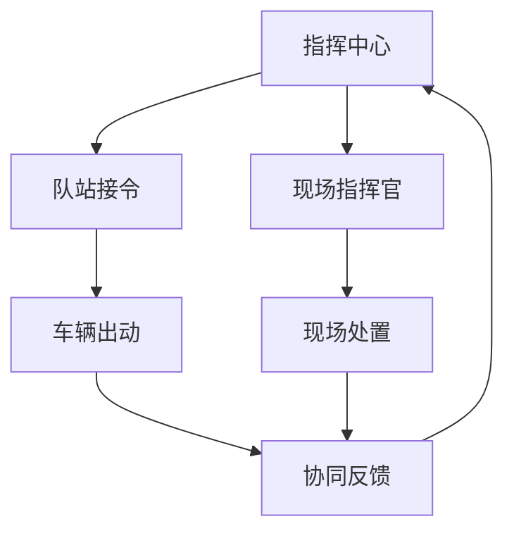

# Step 11：指挥指令下达与协同

**DIKW层级**：Wisdom（智慧层）
**核心职责**：多端推送 + 现场指挥官指令

---

## 1. Step概述

本Step将确认后的指挥方案下达给各队站和现场指挥官，实现多端协同，并通过实时反馈机制保持指挥与现场的同步。

---

## 2. 核心内容

- 多端指令推送
- 队站接令确认
- 现场指挥官调度
- 实时态势反馈
- 指令调整机制

---

## 3. 关键文档

- [[指挥方案生成设计]] —— 指挥方案生成
- [[调度规则模型]] —— 调度规则模型

---

## 4. 下达流程

---

## 5. 多端协同

| 终端 | 接收内容 | 反馈内容 |
|------|----------|----------|
| 队站 | 出动指令、车辆编成 | 接令确认、出动时间 |
| 现场指挥官 | 态势信息、增援请求 | 现场情况、指令执行 |
| 车内终端 | 导航路线、现场信息 | 位置更新、状态报告 |

---

## 6. 输入与输出

| 输入 | 输出 |
|------|------|
| Step 10 确认方案 | 指令下达各端 |
| 调度员授权 | 队站接令确认 |
| 现场反馈 | 态势实时更新 |

---

## 下一步

[[← Step 10 人工确认]] | [[Step 12 → 全程审计与优化反馈]]
