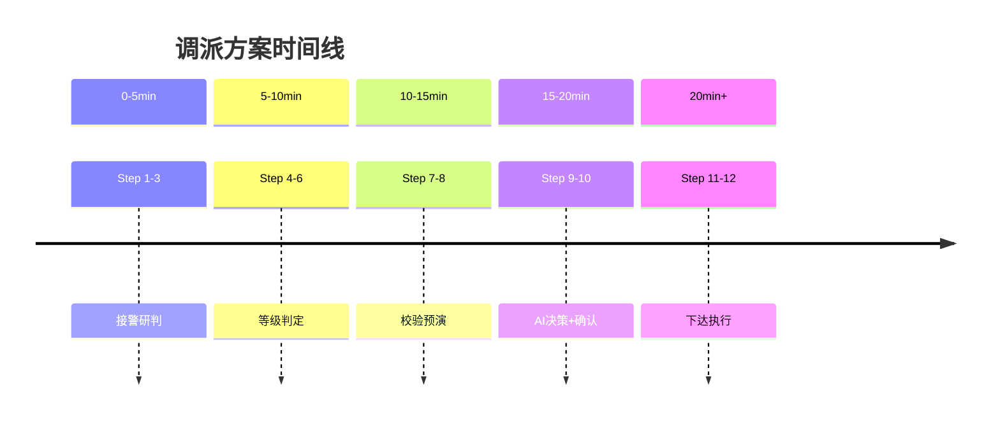

# Step 8：反向模拟与方案预演

**DIKW层级**：Knowledge → Wisdom（知识向智慧转化）
**核心职责**：时间线推演 + 冲突解决

---

## 1. Step概述

本Step通过反向时间线推演，模拟调派方案执行过程，检测潜在的时序冲突和资源争用，提前优化方案。

---

## 2. 核心内容

- 时间线正向推演
- 反向冲突检测
- 资源争用分析
- 方案动态调整
- 预演结果评估

---

## 3. 关键文档

- [[反向验证逻辑]] —— 反向校验逻辑

---

## 4. 推演机制

---

## 5. 输入与输出

| 输入 | 输出 |
|------|------|
| Step 7 校验通过方案 | 推演时间线 |
| 历史案例库 | 冲突预警 |
| 实时路况 | 方案调整建议 |

---

## 下一步

[[← Step 7 约束校验]] | [[Step 9 → AI多智能体协同指挥]]
