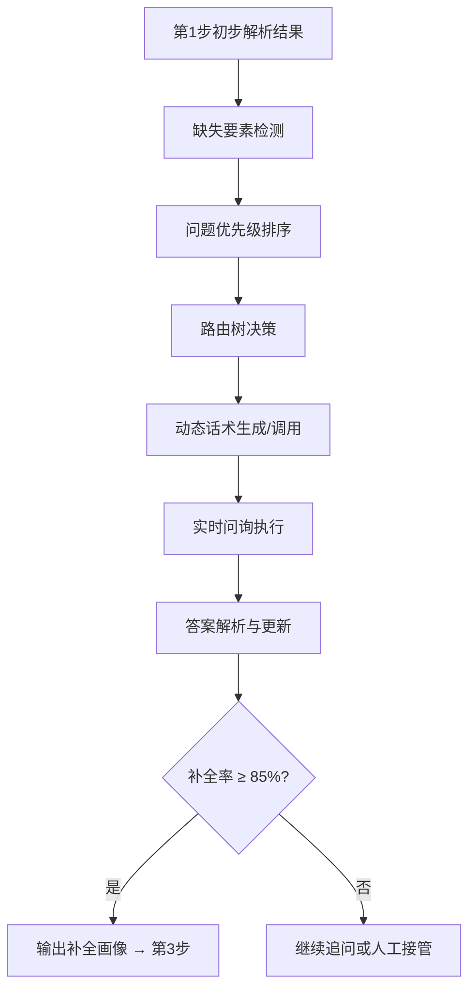

# MOC - Query_Routing 问题路由专区

**所属Part**：Part 3 核心调派引擎
**子模块位置**：`06_DispatchEngine/Query_Routing/`
**更新日期**：2025-04-24
**文档数量**：7份

---

## 模块概述

**Query_Routing** 是调派引擎的**智能问询大脑**，负责在警情初步解析后，**动态识别缺失要素、生成最优问询路径、补全关键信息**，为后续多维画像和等级判定提供高质量数据。

**核心价值**：
- 解决报警人信息不完整、描述混乱的问题
- 实现**非对称问询**（优先问最高优先级问题）
- 显著提升后续AI决策的准确率和置信度

---

## 关键文档导航

### 1. 核心设计文档
- [[非对称问询路由设计]] —— **非对称问询路由设计（V2.0）**（最重要）
- [[问题路由树.md]] —— 问题路由决策树（核心算法）
- [[问题维度映射体系.md]] —— 多维问题维度映射表
- [[补充问题类型维度.md]] —— 补充问题类型维度定义
- [[多维问题与要素识别.md]] —— 多维问题与要素识别机制

### 2. 话术与执行
- [[标准话术库V1]] —— 标准话术库（位置确认、火情规模、人员伤亡等）

### 3. 辅助文档
- [[查询路由/README.md]] —— 本模块总说明

---

## 模块架构图



---

## 重要概念与机制

- **非对称问询**：根据风险优先级动态调整问题顺序
- **问题路由树**：根节点（地址）→ 分支（火情/人员/危化品）
- **标准话术库**：支持个性化调整（语气、安抚、方言）
- **补全率评估**：动态计算，阈值可配置（默认85%）
- **反馈闭环**：人工修改的问题会进入话术库优化

---

## 阅读与使用建议

**推荐阅读顺序**：
1. [[非对称问询路由设计]]（理解整体设计）
2. [[问题路由树.md]]（算法核心）
3. [[标准话术库V1]]（实际执行）
4. [[问题维度映射体系.md]]（维度定义）

**适用人群**：
- 开发人员：重点阅读路由树和维度映射
- 调度员/业务人员：重点阅读标准话术库
- 产品/规则维护人员：重点阅读非对称路由设计

---

## 标签索引
#Query_Routing #智能问询 #非对称路由 #问题路由树 #话术库 #要素识别

---

## 价值点提取

| 文档 | 说明 | 链接 |
|------|------|------|
| **核心知识点汇总** | 包含Query_Routing路由优先级公式 | [[raw/价值点提取_核心知识点汇总.md]] |
| **性能优化策略** | 含Step2问询的性能优化 | [[raw/价值点提取_性能优化策略.md]] |
| **12步Prompt体系** | Step1-11各步Prompt模板、温度控制 | [[raw/价值点提取_12步Prompt体系.md]] |

### 核心公式（快速复习）

**路由优先级公式（V2.0）**：
```
priority_score = (
    风险权重 × 0.55 +
    信息缺失度 × 0.25 +
    时间敏感度 × 0.15 +
    历史同类案例匹配度 × 0.05
)
```

**4大一级分支**：
| 节点 | 触发条件 | 优先级 |
|------|----------|--------|
| 地址精度 | 地址置信度 < 0.7 | ★★★★★ |
| 火情规模 | 出现"明火""爆炸""浓烟" | ★★★★★ |
| 人员伤亡 | 提及"有人""被困""受伤" | ★★★★★ |
| 危险品 | 提及"汽油""电池""化学品" | ★★★★★ |

**结束条件**：补全率达85% 或 连续3个问题无新信息 → 结束问询

---

## 相关链接
- [[MOC-核心调派引擎-详细子模块.md]]（返回Part 3）
- [[约束验证机制]]（下游依赖）
- [[AI支持/01_AILLM应急指挥智能决策支持.md]]（AI决策前置）
- [[Part逻辑映射索引]]

---

**文件结束**
此MOC为Query_Routing专区的**知识导航中心**，建议定期维护话术库和路由树。