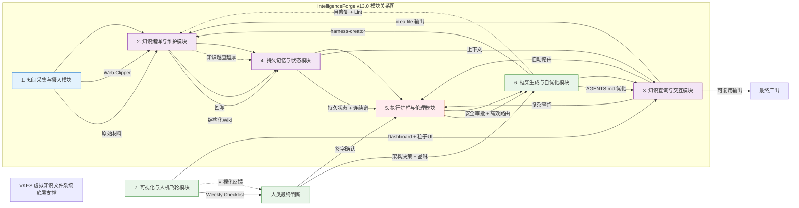

# IntelligenceForge v13.0 模块关系图

**标签**：#模块关系 #Mermaid #流程图 #IntelligenceForge
**位置**：03_SystemDesign/

---

## Mermaid 代码

---

## 关系说明

| 流向 | 说明 |
|------|------|
| **输入流** | A(采集) → B(编译) → D(记忆) |
| **执行流** | C(查询) → E(护栏) → F(框架优化) |
| **输出流** | C 输出 idea file → B 回写 Wiki |
| **反馈进化** | G(可视化) → 人类决策 → F 自优化 → 全系统进化 |
| **底层** | VKFS 贯穿 B/C/D |

---

## 使用方式

- **Obsidian**：安装 Mermaid 插件，复制代码到 `.md` 文件，切换阅读视图
- **在线工具**：mermaid.live 直接渲染

---

## 关联文档

- [[16_IntelligenceForge功能模块划分]] — 功能模块划分
- [[15_IntelligenceForge产品价值点矩阵]] — 产品价值点矩阵

## 变更记录

- 2026-04-24：提取 IntelligenceForge v13.0 模块关系图（Mermaid）