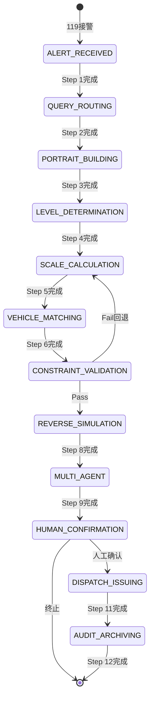

# MOC - 状态机模块 ★

**所属目录**：`06_DispatchEngine/StateMachine/`
**更新日期**：2025-04-25
**版本**：V1.0

---

## 快速导航

| 文档 | 说明 | 优先级 |
|------|------|--------|
| [[StateMachine_Overview.md]] | 状态机整体架构、设计原则、状态图 | ★★★★★ |
| [[StateMachine_12Step_Definition.md]] | 12步完整状态定义、转换规则 | ★★★★★ |
| [[StateMachine_Guards_Actions.md]] | 守卫（Guards）与动作（Actions）详细清单 | ★★★★ |
| [[StateMachine_Fault_Tolerance.md]] | 容错机制、重试、降级、人工接管 | ★★★★★ |
| [[StateMachine_Performance_Optimization.md]] | 性能优化策略、缓存、并行 | ★★★★ |
| [[StateMachine_Monitoring_Dashboard.md]] | 仪表盘设计、指标、告警规则 | ★★★★ |
| [[StateMachine_Implementation_XState.md]] | XState代码实现框架 | ★★★★ |
| [[StateMachine_Transition_Log.md]] | 状态转换日志格式与示例 | ★★★ |

---

## 核心状态图

---

## 状态机设计原则

1. **安全优先**：任何故障都倾向于保守方案或人工介入
2. **可追溯**：每一步转换都有完整日志记录
3. **可观测**：实时状态监控 + 指标采集
4. **可恢复**：故障自动重试 + 降级策略

---

## 核心状态定义

| 状态 | 编码 | 说明 |
|------|------|------|
| 警情接收 | `ALERT_RECEIVED` | 119报警进入系统 |
| 智能问询 | `QUERY_ROUTING` | Query_Routing补全信息 |
| 画像构建 | `PORTRAIT_BUILDING` | 多维要素识别 |
| 等级判定 | `LEVEL_DETERMINATION` | 规则+ML混合判定 |
| 规模计算 | `SCALE_CALCULATION` | 车辆数+编成 |
| 车辆匹配 | `VEHICLE_MATCHING` | 队站+GIS最优 |
| 约束校验 | `CONSTRAINT_VALIDATION` | Pass/Warning/Fail |
| 反向模拟 | `REVERSE_SIMULATION` | 时间线推演 |
| AI多智能体 | `MULTI_AGENT` | 四Agent协同 |
| 人工确认 | `HUMAN_CONFIRMATION` | 调度员最终确认 |
| 方案下达 | `DISPATCH_ISSUING` | 指挥单推送 |
| 审计归档 | `AUDIT_ARCHIVING` | 日志锁定 |

---

## 价值点提取（知识精华）

| 文档 | 说明 | 来源 |
|------|------|------|
| [[价值点提取_StateMachine核心知识点.md]] | 12步状态定义、容错4级、性能KPI | 本地/ raw备份 |
| [[价值点提取_12步状态机必要性分析.md]] | 状态转换图、回退路径、技术选型 | raw/ |
| [[价值点提取_性能优化策略.md]] | 分层优化、瓶颈分析、实施计划 | raw/ |
| [[价值点提取_监控仪表盘实时设计.md]] | 实时管道图、告警中心、历史记录 | raw/ |
| [[价值点提取_高级状态机实现细节.md]] | XState实现、Guards/Actions、Context | raw/ |
| [[价值点提取_性能监控仪表盘设计.md]] | 仪表盘布局、KPI阈值、技术栈 | raw/ |
| [[价值点提取_约束校验机制.md]] | 五维校验、校验分流、API接口 | raw/ |
| [[价值点提取_Step7约束校验机制.md]] | 约束校验完整流程、五维校验 | raw/ |
| [[价值点提取_Step8反向模拟冲突解决.md]] | 时间线推演、冲突检测 | raw/ |
| [[价值点提取_MultiAgent多智能体架构.md]] | 四Agent权重、仲裁机制、动态权重矩阵 | raw/ |
| [[价值点提取_多智能体仲裁机制.md]] | 5阶段仲裁、权重矩阵、LLM仲裁 | raw/ |
| [[价值点提取_多智能体故障处理机制.md]] | 4级容错、Fallback策略、故障恢复 | raw/ |
| [[价值点提取_ML混合判定机制.md]] | 混合融合公式、SHAP可解释性 | raw/ |
| [[价值点提取_12步Prompt体系.md]] | 12步Prompt模板、温度控制 | raw/ |

---

## 相关链接

- [[MOC-核心调派引擎-详细子模块.md]] —— 引擎总MOC
- [[07_Dispatch_Engine_Implementation.md]] —— 引擎实现
- [[04_Constraint_Validation_Mechanism.md]] —— 约束校验
- [[AI_Support/消防多智能体架构.md]] —— 多智能体架构
- [[价值点提取_核心知识点汇总.md\|raw/价值点提取_核心知识点汇总.md]] —— 核心知识汇总（Multi-Agent/仲裁/故障处理）

---

## 标签索引

#状态机 #12步流程 #容错机制 #XState #状态转换 #价值点提取 #性能优化 #监控仪表盘

---

**文件结束**