# Part1-需求层 大体框架图 — 生成Prompt

以下Prompt用于AI图像生成工具（如Midjourney、DALL·E、Stable Diffusion、或代码绘图工具如DiagramGPT/Kroki），生成Part1-需求层的整体框架结构图。

---

## 一、图表类型

**横向全流程架构图（Flow Architecture Diagram）**，左→右为主流程，上方为模块链，下方为细分层级。

---

## 二、详细Prompt

```
生成一张中文技术架构框架图，主题为「Part1：报警人求助模式与场景画像知识库 — AI消防接警需求层」。

整体采用横向分层架构布局，从左到右依次展示从"报警人来话"到"结构化输出"的完整业务闭环。

===== 顶层：七大模块链（横向箭头串联） =====
在图片最上方，用7个圆角矩形卡片横向排列，箭头依次串联：
  场景集 → 场景画像库 → 报警人求助模式库 → 报警人类型模式 → 关键缺失要素库 → 问题路由规则 → 结构化输出

每个模块卡片下方用小字标注该模块回答的核心问题：
- 场景集：[当前报警属于哪类警情？]
- 场景画像库：[这个场景需要获取哪些字段？]
- 求助模式库：[报警人说的这些话对应哪些字段？]
- 报警人类型模式：[这类报警人可信度如何？容易漏什么？]
- 关键缺失要素库：[还缺哪些关键字段？]
- 问题路由规则：[缺失字段按什么优先级问？]
- 结构化输出：[输出什么给后续定级/调派？]

===== 中层：完整业务闭环流程图（左→右流程） =====
用有向箭头+矩形节点从左到右画出完整闭环，共11步：

  报警人自然来话
    → 抽取初始信息
    → 识别警情大类
    → 匹配场景集
    → 调用对应场景画像库
    → 识别报警人求助模式
    → 判断报警人类型
    → 比对已知信息与应采集字段
    → 生成关键缺失要素
    → 根据缺失优先级进入问题路由
    → 输出结构化警情画像与下一步推荐问题

在流程节点间标注关键决策点（菱形判断框）：
- 场景集匹配后 → 判断「是否需要场景切换？」
- 关键缺失生成后 → 判断「A/B/C/D哪级缺失？」
- 问题路由后 → 判断「是否信息充足？」→ 是：输出 / 否：返回追问

===== 左下方区域：场景三层体系 =====
画一个三层倒三角或层级树结构：

  一级场景（警情大类）
  ├── S1 火灾类
  ├── S2 应急救援类
  └── S3 社会救助类

  二级场景（13类业务场景，展开示例）
  ├── 火灾类: 建筑火灾 / 交通工具火灾 / 易燃易爆与危化品火灾 / 室外与自然环境火灾
  ├── 应急救援类: 危险化学品与能源事故 / 重大交通工具事故 / 建构筑物与工程事故 / 自然灾害救援
  └── 社会救助类: 肢体被卡 / 取钥匙 / 水气阀门关闭 / 害虫动物处置 / 高空挂物

  三级场景（40+细分场景，简化为数量标注）
  └── [共40+个细分三级场景]

===== 中下方区域：六类聚类场景画像体系 =====
用一个中心辐射图展示6个聚类及其问题集继承关系：

              聚类6-极端紧急类
              (仅L0，最小必要集)

  聚类1-水域灾害类 ←─── 六场景画像聚类 ───→ 聚类2-普通火灾类
  (L0+水灾专项)                              (L0+L1，默认主场景)

  聚类5-重点单位类 ───→ 中心 ───→ 聚类3-复杂空间与高危结构类
  (L0+L1+重点单位专项)                       (L0+L1+高危结构专项)

              聚类4-人员密集类
              (L0+L1+人员密集专项)

用不同颜色区分6个聚类，标注问题集继承层级：L0 → L1 → L2专项。

===== 右下方区域：四层问题路由体系 =====
画一个纵向分层结构：

  L0层（所有来话必问：位置 + 人员风险 + 警情类型）
    ↓
  Incident Router（警情大类路由：火灾 / 水域 / 救援 / 社会救助）
    ↓
  L1层（标准场景问题：火灾7问 / 水灾5问 / 救援 / 救助）
    ↓
  Building Router（建筑场景路由：普通 / 高危 / 人员密集 / 重点单位）
    ↓
  L2层（场景专项问题：高危9问 / 人员密集8问 / 重点单位9问）
    ↓
  Complete（完成）

===== 底部：A/B/C/D四级缺失要素体系 =====
用横向四色条展示：

  🟥 A级-派警必要缺失（位置、警情类型、是否有人被困、联系方式）
  🟧 B级-风险定级缺失（火势阶段、烟气、水深、危险源、伤亡）
  🟨 C级-调派编成缺失（建筑类型、楼层、地下空间、通道、危化品）
  🟩 D级-现场协同缺失（物业负责人、消控室、断电断气、预案）

===== 右下角：结构化输出七类结果 =====
用竖向列表展示最终输出：
  1. 场景识别结果
  2. 报警人表达模式
  3. 报警人类型判断
  4. 已知信息字段
  5. 关键缺失字段（A/B/C/D分级）
  6. 推荐问题节点（L0→L1→L2）
  7. 风险与调派价值

===== 装饰与连线说明 =====
- 用虚线连接「场景集」→「左下方场景三层体系」，表示场景集展开为三级体系
- 用虚线连接「场景画像库」→「六类聚类体系」，表示场景画像按聚类组织
- 用虚线连接「报警人求助模式库」→「六类表达形态」（事件直陈/现象描述/求救催促/位置先行/人员风险/不确定推测），标注在流程中
- 用虚线连接「报警人类型模式」→「六类报警人」（当事人/邻里/路人/物业/单位负责人/老幼弱者），标注在流程中
- 用虚线连接「关键缺失要素库」→「A/B/C/D分级条」
- 用虚线连接「问题路由规则」→「L0/L1/L2问题层级结构」
- 用虚线连接「结构化输出」→右下角七类结果

===== 配色方案 =====
- 主色调：深蓝（#1a3a5c）+ 橙色强调（#e87722，消防行业配色）
- 7大模块卡片：渐变蓝色系
- 业务闭环流程：深蓝箭头连接
- 六类聚类：6种区分色（蓝/绿/橙/紫/青/红）
- 四级缺失：红→橙→黄→绿渐变
- 路由层级：由浅入深的蓝色

===== 风格 =====
- 专业技术架构图风格
- 清晰的中文标注
- 模块间用圆角矩形
- 流程用箭头连接
- 不要过于拥挤，留白适度
- 适合导出为PNG，分辨率至少2000×1400px
```

---

## 三、简化版Prompt（适合生成更紧凑的图）

如果完整版太复杂，可用以下简化版：

```
生成一张中文AI消防接警系统需求层技术架构图，主题「Part1：报警人求助模式与场景画像知识库」。

布局：顶部横向7模块链 → 中部横向11步业务闭环 → 下方分四个区域。

顶部7模块（箭头串联）：场景集 | 场景画像库 | 求助模式库 | 报警人类型模式 | 关键缺失要素库 | 问题路由规则 | 结构化输出

中部11步闭环（左→右）：报警人来话 → 信息抽取 → 警情识别 → 场景匹配 → 画像调用 → 求助模式识别 → 报警人类型判断 → 信息比对 → 缺失生成 → 路由追问 → 结构化输出

左下：三级场景体系（3大类→13二级→40+三级，树形图）
中下：6类聚类场景画像（辐射图，标注L0/L1/L2继承）
右下：L0→L1→L2三层问题路由 + A/B/C/D四级缺失要素
右下角：7类结构化输出结果

配色：消防行业深蓝+橙色，专业清晰。圆角矩形+箭头连线。分辨率适合PNG导出。
```

---

## 四、Mermaid代码版本（可用于Mermaid Live渲染）

```mermaid
graph TB
    subgraph TOP["七大模块链"]
        direction LR
        M1["场景集<br/><small>属于哪类警情？</small>"]
        M2["场景画像库<br/><small>需要获取哪些字段？</small>"]
        M3["求助模式库<br/><small>对应哪些字段？</small>"]
        M4["报警人类型模式<br/><small>可信度？容易漏什么？</small>"]
        M5["关键缺失要素库<br/><small>还缺哪些关键字段？</small>"]
        M6["问题路由规则<br/><small>按什么优先级问？</small>"]
        M7["结构化输出<br/><small>输出什么？</small>"]
        M1 --> M2 --> M3 --> M4 --> M5 --> M6 --> M7
    end

    subgraph FLOW["完整业务闭环"]
        direction LR
        S1["报警人自然来话"] --> S2["抽取初始信息"]
        S2 --> S3["识别警情大类"]
        S3 --> S4["匹配场景集"]
        S4 --> S5["调用场景画像库"]
        S5 --> S6["识别求助模式"]
        S6 --> S7["判断报警人类型"]
        S7 --> S8["比对已知与应采集字段"]
        S8 --> S9["生成关键缺失要素"]
        S9 --> S10["按缺失优先级路由"]
        S10 --> S11["输出结构化结果"]
    end

    subgraph SCENE["三级场景体系"]
        L1["一级：火灾类 / 应急救援类 / 社会救助类"]
        L2["二级：13类业务场景"]
        L3["三级：40+细分场景"]
        L1 --> L2 --> L3
    end

    subgraph CLUSTER["六类聚类场景画像"]
        C1["聚类1-水域灾害<br/>L0+水灾专项"]
        C2["聚类2-普通火灾<br/>L0+L1"]
        C3["聚类3-高危结构<br/>L0+L1+高危专项"]
        C4["聚类4-人员密集<br/>L0+L1+密集专项"]
        C5["聚类5-重点单位<br/>L0+L1+单位专项"]
        C6["聚类6-极端紧急<br/>仅L0"]
    end

    subgraph ROUTE["四层问题路由"]
        direction TB
        R0["L0 必问层<br/>位置+人员+类型"]
        R1["Incident Router<br/>火灾/水域/救援/救助"]
        R2["L1 标准层<br/>火灾7问/水灾5问"]
        R3["Building Router<br/>普通/高危/密集/重点"]
        R4["L2 专项层<br/>高危9问/密集8问/单位9问"]
        RC["Complete 完成"]
        R0 --> R1 --> R2 --> R3 --> R4 --> RC
    end

    subgraph MISSING["A/B/C/D四级缺失"]
        MA["🔴A级 派警必要<br/>位置/类型/被困/联系方式"]
        MB["🟠B级 风险定级<br/>火势/烟气/水深/危险源"]
        MC["🟡C级 调派编成<br/>建筑/楼层/通道/危化品"]
        MD["🟢D级 现场协同<br/>物业/消控室/断电/预案"]
    end

    subgraph OUTPUT["七类结构化输出"]
        O1["①场景识别结果"]
        O2["②报警人表达模式"]
        O3["③报警人类型判断"]
        O4["④已知信息字段"]
        O5["⑤关键缺失字段"]
        O6["⑥推荐问题节点"]
        O7["⑦风险与调派价值"]
    end
```



---

## 五、使用建议

1. **推荐首选**：将「完整版Prompt」输入到 AI 代码绘图工具（如 DiagramGPT、Napkin AI 等）或让 Claude/GPT 编写 Python（matplotlib/Plotly）代码生成
2. **快速预览**：复制 Mermaid 代码到 [Mermaid Live](https://mermaid.live/) 在线渲染预览
3. **专业出版**：将Prompt给设计师，用 Figma / draw.io / Visio 手工绘制
4. **PNG导出**：分辨率≥2000×1400px，DPI≥150
