# FireDispatchEngine 知识库架构流程图

**标签**：#知识库架构 #Mermaid #流程图 #全局导航
**位置**：00_GlobalNavigation/

---

## 横向流程图（从左到右）

```mermaid
flowchart LR
    %% 整体布局 - 横向流程
    direction LR

    %% 根节点
    Root((FireDispatchEngine<br/>消防调派智能系统<br/>完整知识库 v2.1))

    %% 第一阶段：导航与需求
    subgraph 导航需求 ["00-02 导航与需求分析"]
        Nav[00_GlobalNavigation<br/>思维导图 + 目录总览]
        Req[01_Requirements<br/>需求与业务分析<br/>21份]
        Sce[02_Scenarios<br/>火灾场景库<br/>5份全链路模拟]
    end

    %% 第二阶段：设计与模型
    subgraph 设计模型 ["03-05 系统设计与数据模型"]
        Sys[03_SystemDesign<br/>系统设计层<br/>25份]
        DIKW[04_DIKW_Examples<br/>知识转化示例]
        Data[05_DataModel<br/>数据模型层<br/>16份]
    end

    %% 第三阶段：核心引擎（重点高亮）
    subgraph 核心引擎 ["06_核心调派引擎 ★"]
        Engine[06_DispatchEngine<br/>警情映射 + 约束校验<br/>路由 + AI支持<br/>18份]
    end

    %% 第四阶段：审计优化与收尾
    subgraph 审计收尾 ["07-10 审计责任、数学与收尾"]
        Audit[07_Audit_And_Responsibility<br/>人工确认 + 审计留痕]
        Math[08_Math_And_Optimization<br/>数学模型全链路]
        Road[09_Roadmap<br/>项目路线图]
        App[10_Appendix<br/>公式汇总 + 附录]
    end

    %% 连接关系（横向主流程）
    Root --> Nav
    Nav --> Req
    Req --> Sce
    Sce --> Sys
    Sys --> DIKW
    DIKW --> Data
    Data --> Engine
    Engine --> Audit
    Audit --> Math
    Math --> Road
    Road --> App

    %% 样式优化
    classDef core fill:#ffcc00,stroke:#d97706,color:#000,stroke-width:4px;
    classDef stage1 fill:#e0f2fe,stroke:#0ea5e9;
    classDef stage2 fill:#f0fdf4,stroke:#4ade80;
    classDef stage3 fill:#fef3c7,stroke:#fbbf24;
    classDef stage4 fill:#fee2e9,stroke:#f472b6;

    class Engine core
    class 导航需求 stage1
    class 设计模型 stage2
    class 核心引擎 stage3
    class 审计收尾 stage4
```



---

## 核心结构

```
导航需求（00-02）→ 设计模型（03-05）→ 核心引擎（06）★ → 审计收尾（07-10）
```

---

## 分组说明（重组后）

| 分组 | 内容 | 文档数 |
|------|------|--------|
| **Part 1 导航需求** | 全局导航、需求分析、火灾场景库 | ~32份 |
| **Part 2 设计模型** | 系统设计、DIKW示例、数据模型 | ~47份 |
| **Part 3 核心引擎 ★** | 警情映射、约束校验、路由、AI支持 | 20份 |
| **Part 4 审计收尾** | 审计留痕、数学模型、路线图、附录 | ~16份 |

## Part 映射

| Part | 目录 | 说明 |
|------|------|------|
| Part 1 | 01_Requirements + 02_Scenarios | 需求与场景层 |
| Part 2 | 03_SystemDesign + 04_DIKW + 05_DataModel | 系统设计与数据模型 |
| Part 3 | 06_DispatchEngine | **核心调派引擎 ★** |
| Part 4 | 07_Audit + 08_Math + 09_Roadmap + 10_Appendix | 审计责任与附录 |

---

## 使用方式

1. 复制上方 Mermaid 代码
2. 粘贴到支持 Mermaid 的工具（Typora / Obsidian / 飞书 / 语雀 / Draw.io）
3. 效果：清晰的横向流程图，从左到右展示知识库构建流程

---

## 关联文档

- [[消防调派智能系统思维导图]] — 思维导图（树形结构）
- [[index]] — 项目主索引

## 变更记录

- 2026-04-25：提取 FireDispatchEngine 知识库架构流程图