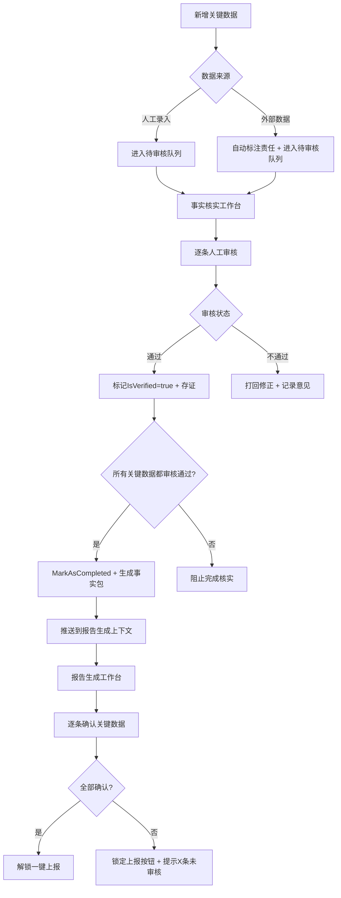

# FRICP 逐条人工审核机制设计（修订版）

**版本**：V1.0（修订版）
**修订日期**：2026-04-26
**核心原则**：关键数据必须一条条人工审核，系统强制阻止跳过

---

## 1. 修订原则

| 原则 | 说明 |
|------|------|
| **关键数据定义** | 伤亡人数、被困人数、重大险情描述、处置进展等直接影响报告内容和事故等级判断的数据 |
| **人工审核机制** | 必须一条条人工审核确认，不能批量自动通过 |
| **系统强制** | 未完成一条条人工审核的关键数据，不能进入报告事实部分，也不能触发上报 |

---

## 2. 事实核实上下文修订设计

### 聚合根：VerificationRecord（核实记录）

### 关键行为调整

#### AddFactItem(FactItem item)
- **输入**：FactItem
- **处理**：添加事实项后，自动标记为"待人工审核"（IsVerified = false）
- **输出**：FactItem入队待审核

#### ReviewFactItem(FactItem item, Reviewer reviewer)
**核心方法：一条条人工审核**

| 要素 | 说明 |
|------|------|
| 输入 | 具体FactItem + 审核人 |
| 处理 | 记录审核人、审核时间、审核意见（可选） |
| 输出 | 该FactItem的IsVerified = true |
| **强制规则** | 每一条关键数据（伤亡、被困等）必须单独调用此方法审核，不能批量跳过 |

#### MarkAsCompleted()
- **前置条件**：所有关键FactItem都已一条条人工审核通过（IsVerified = true）
- **处理**：将整个记录标记为Completed
- **输出**：生成事实包，推送给报告生成上下文

### 页面交互（事实核实工作台）

| 交互元素 | 说明 |
|----------|------|
| 审核确认按钮 | 事实列表中，每一条关键数据后都有独立的"审核确认"按钮 |
| 高亮显示 | 未审核的关键数据高亮显示"待人工审核" |
| 完成按钮 | "完成核实并推送"按钮仅在所有关键数据审核通过后可用 |

---

## 3. 报告生成上下文修订设计

### 聚合根：Report（报告）

### 关键行为调整

#### CreateFromFactPackage()
- **输入**：事实包（FactPackage）
- **校验**：每一条FactItem都必须带有IsVerified = true标记
- **前置条件**：未满足校验则拒绝创建报告

#### ReviewAndConfirm()
**升级为逐条审核确认模式**

| 要素 | 说明 |
|------|------|
| 显示 | 系统以列表形式显示事实列表 |
| 操作 | 指挥员必须对每一条关键数据（伤亡、被困等）单独点击"确认无误" |
| 完成条件 | 全部关键数据都逐条确认后，报告Status改为"已审核" |
| 存证 | 自动记录审核人、审核时间 |

#### SubmitReport()
- **前置条件**：所有关键数据都逐条人工审核确认
- **校验**：未满足时阻止上报
- **输出**：正式上报 + 实时共享

### 页面交互（报告生成工作台）

| 交互元素 | 说明 |
|----------|------|
| 人工审核复选框 | 事实部分以列表形式展示，每一条关键数据后都有独立的"人工审核确认"复选框/按钮 |
| 上报按钮状态 | 未完成逐条审核时，"一键上报"按钮置灰 |
| 提示信息 | 置灰时提示"还有X条关键数据未审核" |
| 审核存证 | 每一条数据的审核动作单独记录（谁审核了哪一条、时间、意见） |

---

## 4. 整体合规强化机制

### 系统强制

| 机制 | 说明 |
|------|------|
| **技术层面阻止跳过** | 按钮灰色 + 校验，强制逐条审核 |
| **Audit审计强化** | 每一条关键数据的审核动作都单独记录到合规审计上下文 |
| **人工录入联动** | 人工录入的新事实项自动进入"待审核"状态，必须逐条确认后才能用于报告 |

### 痛点解决

| 痛点 | 解决方案 |
|------|----------|
| 伤亡数据难获取 | 通过人工录入 + 逐条审核确保准确 |
| 人工判断遗漏 | 清单式逐条审核减少遗漏风险 |
| 责任追溯 | 每一条数据的审核都有记录 |

### 合规闭环

```
人工录入 → 待审核状态 → 逐条人工审核 → 审核记录存证 → 事实包推送
                                                            ↓
                                           报告生成上下文 → 逐条确认 → 一键上报
```

---

## 5. 关键数据审核流程图



---

## 6. 审核操作数据库记录

### 事实核实审核记录

```sql
CREATE TABLE fact_review_record (
    review_id        BIGSERIAL PRIMARY KEY,
    fact_item_id     VARCHAR(64) NOT NULL,
    reviewer_id      VARCHAR(32) NOT NULL,
    reviewer_role    VARCHAR(20),  -- 值班主任/指挥长
    review_time      TIMESTAMP NOT NULL,
    review_result    VARCHAR(10),  -- PASS/REJECT
    review_comment   TEXT,
    incident_id      VARCHAR(32),
    created_at       TIMESTAMP DEFAULT CURRENT_TIMESTAMP
);

CREATE INDEX idx_fact_review_incident ON fact_review_record(incident_id);
CREATE INDEX idx_fact_review_fact_item ON fact_review_record(fact_item_id);
```

### 报告审核记录

```sql
CREATE TABLE report_review_record (
    review_id        BIGSERIAL PRIMARY KEY,
    report_id        VARCHAR(64) NOT NULL,
    fact_item_id     VARCHAR(64) NOT NULL,  -- 关联到具体关键数据
    reviewer_id      VARCHAR(32) NOT NULL,
    review_time      TIMESTAMP NOT NULL,
    confirmed        BOOLEAN NOT NULL,
    created_at       TIMESTAMP DEFAULT CURRENT_TIMESTAMP
);

CREATE INDEX idx_report_review_report ON report_review_record(report_id);
```

---

## 7. 状态机流转

### FactItem状态

```
PENDING_REVIEW（待审核） → REVIEWED（已审核）→ USED_IN_REPORT（已入报告）
                         ↓
                    REJECTED（已驳回）→ MODIFIED（已修正）→ PENDING_REVIEW
```

### VerificationRecord状态

```
DRAFT（草稿）→ IN_REVIEW（审核中）→ COMPLETED（已完成）→ PUSHED（已推送）
```

### Report状态

```
CREATED（已创建）→ IN_REVIEW（审核中）→ REVIEWED（已审核）→ SUBMITTED（已上报）
```

---

**文件结束**