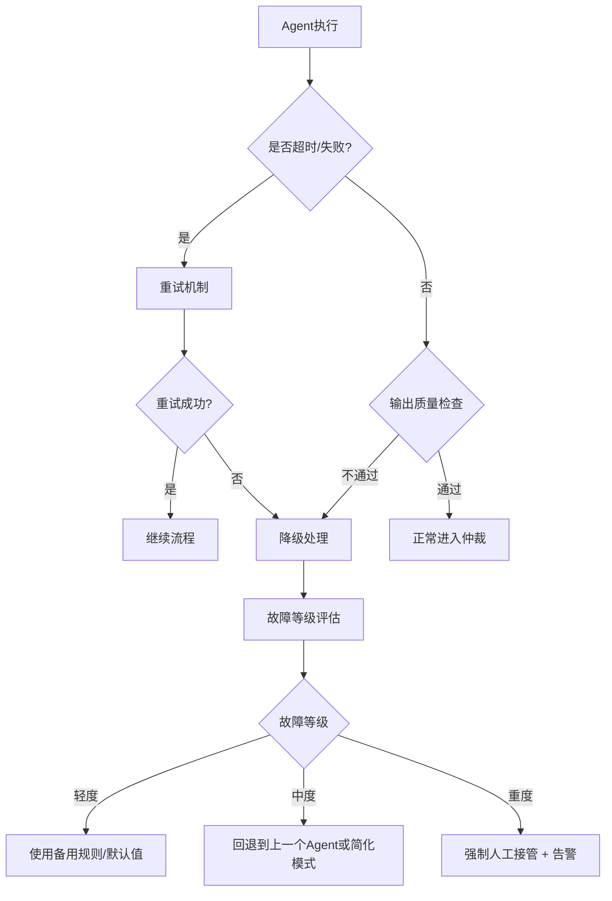

# 多智能体故障处理机制 - 价值点提取

**标签**：#多智能体 #故障处理 #容错机制 #降级策略 #故障恢复
**提取日期**：2025-04-25
**来源**：多智能体故障处理机制v6.2.txt
**版本**：V1.0

---

## 1. 故障处理总体原则

| 原则 | 说明 |
|------|------|
| **安全优先** | 任何故障都倾向于保守方案或人工介入 |
| **分级降级** | 自动恢复 → 局部降级 → 全局回退 → 人工接管 |
| **全链路可观测** | 所有故障记录到审计日志 |
| **快速恢复** | 目标恢复时间 < 15秒 |

---

## 2. 故障处理流程

---

## 3. 故障分级与处理策略

| 等级 | 典型场景 | 处理策略 | 恢复时间 | 通知人工 |
|------|----------|----------|----------|----------|
| **轻度** | 单Agent超时、置信度低 | 重试1次+默认值 | < 5秒 | 否 |
| **中度** | 2个Agent失败、仲裁冲突大 | 降级模式（关闭预测Agent） | 5-15秒 | 记录警告 |
| **重度** | 3个以上Agent失败 | 纯规则模式+强制人工确认 | < 10秒 | 是（高亮） |
| **致命** | 框架崩溃、核心服务不可用 | 全局降级为纯人工模式 | 立即 | 是（推送值班长） |

---

## 4. 单Agent故障Fallback策略

| Agent | 失败时Fallback |
|-------|----------------|
| Perception | 使用第3步静态画像 |
| Decision | 使用规则引擎默认战术 |
| Execution | 使用简化时间线模板 |
| Prediction | 使用保守预测（最坏情况假设） |

---

## 5. 重试机制

- **最多重试次数**：2次
- **指数退避**：1s → 3s
- **超时时间**：15秒

---

## 6. 监控告警配置

### 关键指标
- Agent成功率（过去1小时）
- 平均仲裁时间
- 故障率（轻/中/重）
- 人工接管比例

### 告警规则
| 指标 | 阈值 | 告警级别 |
|------|------|----------|
| Agent成功率 | < 90% | 黄色 |
| 人工接管率 | > 15% | 橙色 |
| 连续3次重度故障 | - | 红色+推送值班长 |

---

## 7. 故障恢复与持续优化

| 机制 | 说明 |
|------|------|
| 经验回放池 | 所有故障数据进入回放池 |
| 每周微调 | 使用故障案例对Agent和Prompt微调 |
| 故障知识库 | 建立快速恢复参考 |

---

## 8. 系统级故障处理

| 故障场景 | 处理策略 |
|----------|----------|
| Redis/向量数据库不可用 | 切换到纯规则模式 |
| GPU推理服务崩溃 | 切换到CPU备用模型 |
| 全系统不可用 | 自动切换到**纯人工调派模式** |

---

**文件结束**